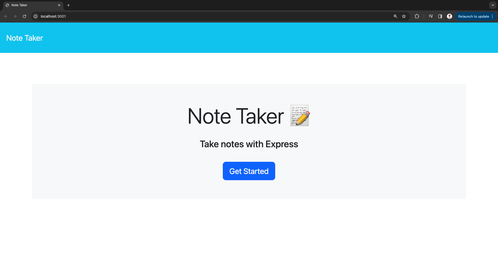
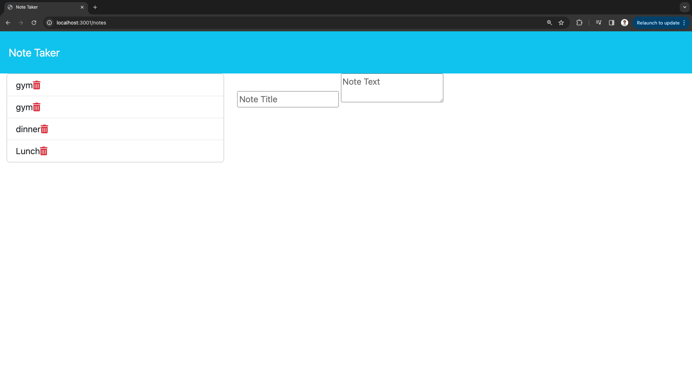
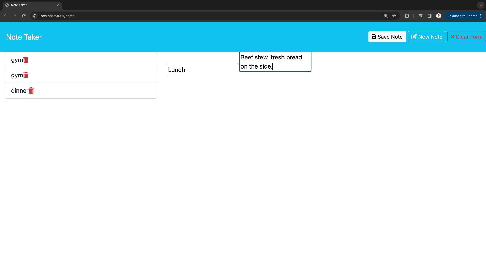
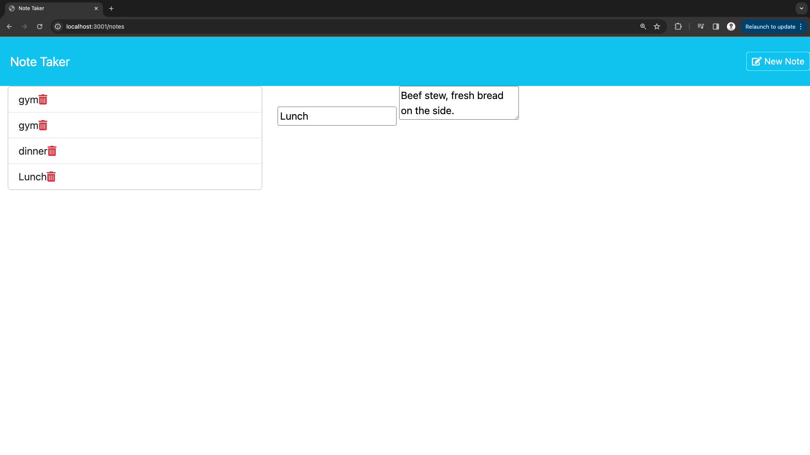

# Note Taker

  

  ## Description
  The Note Taker application allows the user to to record a title and a body for a note they wish to save. When the user fills out the form and clicks the save button the note is displayed on the left side of the notes page. This is done with an node.js backend running the express library to route all requests made from the application. 

  ## Table of Contents
  - [Installation](#installation)
  - [Usage](#usage)
  - [License](#license)
  - [Contributing](#contributing)
  - [Tests](#tests)
  - [Questions](#questions)
  
  
  ## Installation
  No installation required. App is run on live server. 
  
  ## Usage
  When you click 'Get Started' from the home page you are taken to the notes page where you are able to add new or view past notes. when you fill out the blank form with a title body and click save note the note is added to the note list on the left and the form is emptied. You are able to view any details from past notes by clicking on the words from the list.

    
   
   
   

  [live URL](https://pacific-reaches-58147-0290a2341db0.herokuapp.com/)
  
  ## License
  MIT License

  ## How to Contribute
  Feel free to contact me with any ideas.
    
  ## Tests
  N/A

  ## Questions
  [Github Profile](https://github.com/garrethil)

  For any further questions you may contact me at this email: garrethildebrandt@gmail.com
  
